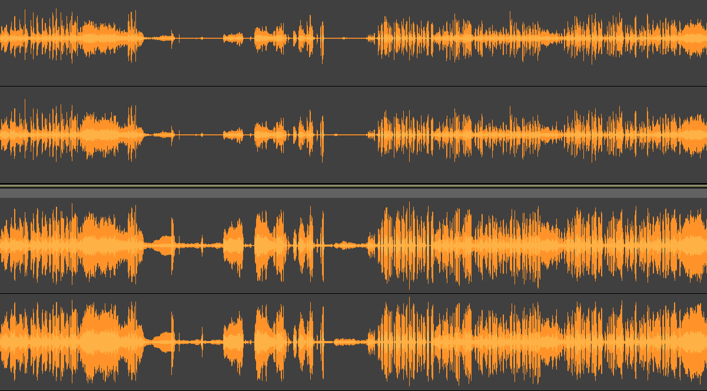

Some movies take advantace of the full dynamic range avaialble to modern AV equipment reproducing the sound of a pin dropping
and the sound of a planet being torn in half within 50ms of eachother. In a theather this is awesome, laying on the couch at
home this is less awesome. normalizer.sh will add a new audio track to a movie file that contains the original sound track but
with normalized volume. This takes away from some of the experience but you will be able to set the volume ONCE and never touch
the remote again.

The lower, normalized, track has a smaller range in volume between the quietest and loudest sections compared to the original.

